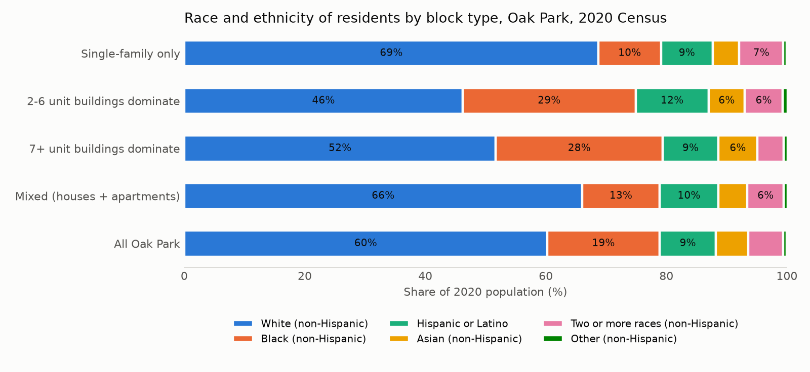
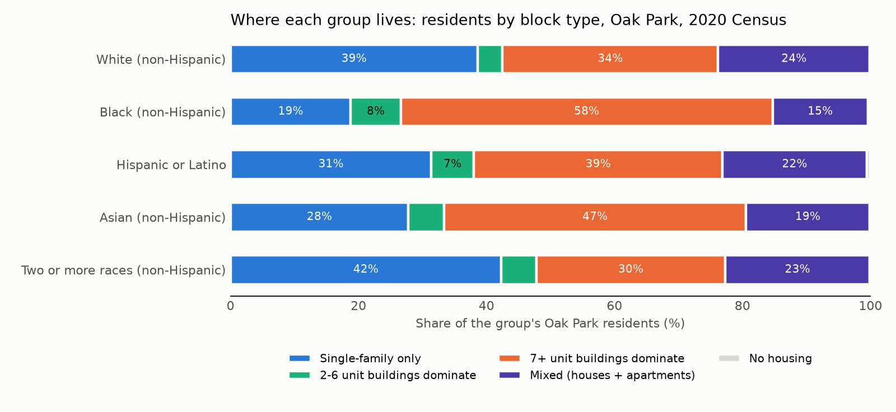

# Race and ethnicity by block type, Oak Park, Illinois

Every number below is produced by the pipeline in this repository from the
sources listed in PROVENANCE.md. Blocks are 2020 Census blocks; block types come
from the Cook County Assessor's 2026 parcel data; residents come from the 2020
Census (P.L. 94-171 table P2). Totals are reported for whole categories of
blocks only, never for individual blocks.

## Block types

A block is **single-family only** when at least 95% of its housing units are
single-family houses (detached, or attached townhomes). It is **2-6 unit** or **7+ unit** when
buildings of that size hold at least half of its units. Everything else with housing is
**mixed**: typically houses alongside 2-flats, small apartment buildings or a condo building.

| category | Blocks | Units (parcels) | Units (2020 Census) | % single-family | % in 2-6 unit bldgs | % in 7+ unit bldgs | Units estimated |
|---|---|---|---|---|---|---|---|
| Single-family only | 462 | 5,973 | 6,018 | 100 | 0 | 0 | 0 |
| 2-6 unit buildings dominate | 67 | 1,254 | 1,207 | 19.7 | 68.2 | 12.1 | 7 |
| 7+ unit buildings dominate | 213 | 15,881 | 14,183 | 6.5 | 7.2 | 86.3 | 1,753 |
| Mixed (houses + apartments) | 218 | 4,378 | 4,489 | 70 | 21.2 | 8.8 | 0 |
| No housing | 98 | 0 | 56 | 0 | 0 | 0 | 0 |

## A. Who lives on each block type (2020 Census)

Oak Park's 2020 population was 54,583: 60.2% White (non-Hispanic), 18.7% Black (non-Hispanic), 9.3% Hispanic or Latino, 5.4% Asian (non-Hispanic).

| category | Blocks | Population | White | Black | Hispanic or Latino | Asian | Two or more races | Other |
|---|---|---|---|---|---|---|---|---|
| Single-family only | 462 | 18,464 | 68.7 | 10.4 | 8.6 | 4.4 | 7.3 | 0.6 |
| 2-6 unit buildings dominate | 67 | 2,784 | 46.2 | 28.7 | 12.1 | 6 | 6.3 | 0.8 |
| 7+ unit buildings dominate | 213 | 21,440 | 51.7 | 27.7 | 9.2 | 6.5 | 4.4 | 0.6 |
| Mixed (houses + apartments) | 218 | 11,797 | 66 | 12.9 | 9.7 | 4.8 | 6.1 | 0.6 |
| No housing | 98 | 98 | 22.4 | 33.7 | 28.6 | 5.1 | 6.1 | 4.1 |
| all blocks | 1,058 | 54,583 | 60.2 | 18.7 | 9.3 | 5.4 | 5.8 | 0.6 |

## B. Where each group lives

Share of each group's Oak Park residents living on each block type.

| category | Population | White | Black | Hispanic or Latino | Asian | Two or more races | Other |
|---|---|---|---|---|---|---|---|
| Single-family only | 18,464 | 38.6 | 18.8 | 31.4 | 27.8 | 42.3 | 32.8 |
| 2-6 unit buildings dominate | 2,784 | 3.9 | 7.8 | 6.6 | 5.6 | 5.5 | 6.4 |
| 7+ unit buildings dominate | 21,440 | 33.7 | 58.1 | 38.9 | 47.1 | 29.5 | 39.6 |
| Mixed (houses + apartments) | 11,797 | 23.7 | 14.9 | 22.5 | 19.4 | 22.6 | 19.9 |
| No housing | 98 | 0.1 | 0.3 | 0.6 | 0.2 | 0.2 | 1.2 |

## C. Sensitivity to the single-family cutoff

Single-family cutoff at 100% of units:

| category | Blocks | Population | White | Black | Hispanic or Latino | Asian | Two or more races | Other |
|---|---|---|---|---|---|---|---|---|
| Single-family only | 460 | 18,330 | 68.8 | 10.2 | 8.6 | 4.5 | 7.3 | 0.6 |
| 2-6 unit buildings dominate | 67 | 2,784 | 46.2 | 28.7 | 12.1 | 6 | 6.3 | 0.8 |
| 7+ unit buildings dominate | 213 | 21,440 | 51.7 | 27.7 | 9.2 | 6.5 | 4.4 | 0.6 |
| Mixed (houses + apartments) | 220 | 11,931 | 65.8 | 13.2 | 9.7 | 4.8 | 6.1 | 0.6 |
| No housing | 98 | 98 | 22.4 | 33.7 | 28.6 | 5.1 | 6.1 | 4.1 |
| all blocks | 1,058 | 54,583 | 60.2 | 18.7 | 9.3 | 5.4 | 5.8 | 0.6 |

Single-family cutoff at 90% of units:

| category | Blocks | Population | White | Black | Hispanic or Latino | Asian | Two or more races | Other |
|---|---|---|---|---|---|---|---|---|
| Single-family only | 476 | 19,449 | 68.6 | 10.6 | 8.6 | 4.5 | 7.2 | 0.6 |
| 2-6 unit buildings dominate | 67 | 2,784 | 46.2 | 28.7 | 12.1 | 6 | 6.3 | 0.8 |
| 7+ unit buildings dominate | 213 | 21,440 | 51.7 | 27.7 | 9.2 | 6.5 | 4.4 | 0.6 |
| Mixed (houses + apartments) | 204 | 10,812 | 65.9 | 12.7 | 9.9 | 4.7 | 6.2 | 0.6 |
| No housing | 98 | 98 | 22.4 | 33.7 | 28.6 | 5.1 | 6.1 | 4.1 |
| all blocks | 1,058 | 54,583 | 60.2 | 18.7 | 9.3 | 5.4 | 5.8 | 0.6 |

Every estimated 7+ building unit count (buildings absent from the Commercial Valuation
dataset, whose units are estimated from assessed value) replaced by the class minimum of 7:

| category | Blocks | Population | White | Black | Hispanic or Latino | Asian | Two or more races | Other |
|---|---|---|---|---|---|---|---|---|
| Single-family only | 462 | 18,464 | 68.7 | 10.4 | 8.6 | 4.4 | 7.3 | 0.6 |
| 2-6 unit buildings dominate | 68 | 2,815 | 45.8 | 29.2 | 12.1 | 5.9 | 6.3 | 0.8 |
| 7+ unit buildings dominate | 211 | 21,375 | 51.7 | 27.6 | 9.2 | 6.5 | 4.4 | 0.6 |
| Mixed (houses + apartments) | 219 | 11,831 | 66 | 12.8 | 9.7 | 4.9 | 6.1 | 0.5 |
| No housing | 98 | 98 | 22.4 | 33.7 | 28.6 | 5.1 | 6.1 | 4.1 |
| all blocks | 1,058 | 54,583 | 60.2 | 18.7 | 9.3 | 5.4 | 5.8 | 0.6 |

## D. Block groups classified by their own housing mix

Census block groups are the smallest geography with published ACS estimates, and their
2020 counts carry far less disclosure-avoidance noise than blocks. Each block group is
classified by the same rule applied to all of its units. Most Oak Park block groups are
internally mixed, so this is a coarser cut.

2020 Census counts:

| category | Block groups | Population | White | Black | Hispanic or Latino | Asian | Two or more races | Other |
|---|---|---|---|---|---|---|---|---|
| Single-family only | 3 | 2,813 | 73.9 | 7.8 | 6 | 4.5 | 7.1 | 0.7 |
| 7+ unit buildings dominate | 20 | 22,446 | 54.4 | 23.4 | 10 | 6.4 | 5.2 | 0.7 |
| Mixed (houses + apartments) | 30 | 29,324 | 63.3 | 16.1 | 9.1 | 4.7 | 6.2 | 0.5 |
| all blocks | 53 | 54,583 | 60.2 | 18.7 | 9.3 | 5.4 | 5.8 | 0.6 |

ACS 2020-2024 five-year estimates (percent, with 90% margin of error):

| category | Block groups | Population | White | Black | Hispanic or Latino | Asian | MOE White | MOE Black | MOE Hispanic | MOE Asian |
|---|---|---|---|---|---|---|---|---|---|---|
| Single-family only | 3 | 2,551 | 75.2 | 5.4 | 8.9 | 3 | 8.4 | 3.8 | 6.5 | 2.2 |
| 7+ unit buildings dominate | 20 | 22,256 | 58.8 | 22.1 | 8.9 | 4.6 | 3.3 | 3.5 | 2.1 | 1.5 |
| Mixed (houses + apartments) | 30 | 28,485 | 62.4 | 15.6 | 9.7 | 5.7 | 1.9 | 2.9 | 2.2 | 2 |

## E. Within-block-group contrast

Only block groups that contain more than one block type, so each comparison holds the
neighbourhood constant. This is the comparison most exposed to the 2020 disclosure-avoidance
noise, which shifts people between blocks within a block group and therefore shrinks
differences; treat it as a lower bound on the true contrast.

| category | Block groups | Blocks | Population | White | Black | Hispanic or Latino | Asian | Two or more races | Other |
|---|---|---|---|---|---|---|---|---|---|
| Single-family only | 47 | 438 | 17,603 | 68.2 | 10.6 | 8.8 | 4.4 | 7.4 | 0.6 |
| 2-6 unit buildings dominate | 32 | 67 | 2,784 | 46.2 | 28.7 | 12.1 | 6 | 6.3 | 0.8 |
| 7+ unit buildings dominate | 46 | 207 | 20,428 | 51.6 | 27.8 | 9.2 | 6.5 | 4.4 | 0.6 |
| Mixed (houses + apartments) | 41 | 218 | 11,797 | 66 | 12.9 | 9.7 | 4.8 | 6.1 | 0.6 |
| all blocks | 51 | 930 | 52,612 | 60.1 | 18.8 | 9.3 | 5.4 | 5.9 | 0.6 |

Paired difference in percentage points versus the single-family blocks of the same block
group (weighted by the smaller population of each pair; positive = higher share on this block type):

| category | Pairs | White | Black | Hispanic or Latino | Asian | Two or more races | Other |
|---|---|---|---|---|---|---|---|
| 2-6 unit buildings dominate | 29 | -22.4 | +20.0 | +1.6 | +2.4 | -1.7 | +0.1 |
| 7+ unit buildings dominate | 42 | -18.7 | +22.8 | -1.3 | +0.7 | -3.3 | -0.1 |
| Mixed (houses + apartments) | 39 | -3.8 | +5.0 | +0.1 | +0.7 | -1.9 | -0.1 |

## A2. Excluding group-quarters blocks

Blocks where more than 25% of residents live in group quarters (nursing homes,
dormitories) removed.

| category | Blocks | Population | White | Black | Hispanic or Latino | Asian | Two or more races | Other |
|---|---|---|---|---|---|---|---|---|
| Single-family only | 462 | 18,464 | 68.7 | 10.4 | 8.6 | 4.4 | 7.3 | 0.6 |
| 2-6 unit buildings dominate | 66 | 2,728 | 46.9 | 27.6 | 12.2 | 6 | 6.4 | 0.8 |
| 7+ unit buildings dominate | 211 | 21,260 | 51.4 | 27.8 | 9.3 | 6.5 | 4.4 | 0.6 |
| Mixed (houses + apartments) | 218 | 11,797 | 66 | 12.9 | 9.7 | 4.8 | 6.1 | 0.6 |
| No housing | 97 | 86 | 25.6 | 26.7 | 30.2 | 5.8 | 7 | 4.7 |
| all blocks | 1,054 | 54,335 | 60.2 | 18.6 | 9.3 | 5.4 | 5.9 | 0.6 |

## Notes on the 2020 Census numbers

The 2020 Census applied differential privacy (the TopDown Algorithm) to every count below
the state level. Block-level race counts are noisy and biased toward looking more diverse
than they are; total housing units per block are exact. Sums over hundreds of blocks, as
reported here, cancel most of that noise, and cancel it entirely where a block type covers
whole block groups. Section D uses block-group counts, which are much less noisy, as a check.
