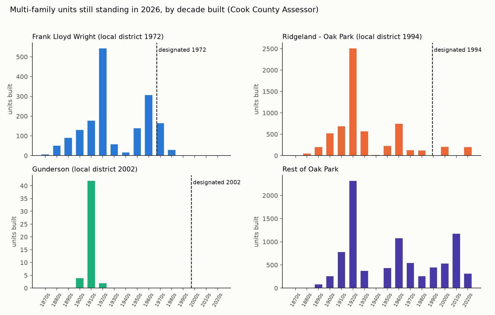

# Multi-family construction before and after historic-district designation, Oak Park

Every number here is produced by `s10_districts.py` and `s11_district_analysis.py` from the
Cook County Assessor's 2026 roll and the Village's GIS boundaries; lineage in PROVENANCE.md.

## Districts and dates

| District | Local designation (regulatory) | National Register | Note |
|---|---|---|---|
| Frank Lloyd Wright | 1972-02-07 (Ord. 1972-O-8) | 1973-12-04 | Current polygon is the boundary as expanded on the National Register in 2009 and locally in 2012 (about 444 parcels added to the 1,491 of 1972); the 1972 boundary is not available as GIS data, so a sensitivity run treats 2012 as the designation year for the whole polygon. |
| Ridgeland - Oak Park | 1994 | 1983-12-08 | Local district, designated 1994; National Register listing 1983. |
| Gunderson | 2002-06-17 (Ord. 2003-O-28 (expansion)) | 2002 | Local district designated 2002 (north), expanded 2003 (south). |

Sources for the dates are listed in `config.py` (Village Code 7-9-3; Village district
brochures and nomination report; Wednesday Journal 2014-11-25; Patch 2011-03-22; NRHP).
Local designation is what brings demolition and exterior-alteration review; the National
Register listing itself carries no control over private owners.

## What counts

A multi-family building has two or more dwelling units in one structure: 2-6 unit buildings,
7+ unit buildings, and condominium buildings (counted as buildings, by the year the structure
was built, whatever its tenure today). Townhomes are excluded. A building belongs to a district
when its parcel's representative point lies inside the Village's district polygon. Only
buildings standing on the 2026 assessment roll are visible: anything demolished is absent.

## Housing units by district today (2026 roll)

| district | Units | % single-family | % in 2-6 unit bldgs | % in 7+ unit bldgs |
|---|---|---|---|---|
| Frank Lloyd Wright | 3,410 | 49.2 | 12.3 | 38.5 |
| Ridgeland - Oak Park | 7,545 | 16.8 | 10.9 | 72.3 |
| Gunderson | 315 | 84.8 | 15.2 | 0 |
| Rest of Oak Park | 15,899 | 44.7 | 10.3 | 45 |

## G. Multi-family units by decade built

| district | pre-1890 | 1890s | 1900s | 1910s | 1920s | 1930s | 1940s | 1950s | 1960s | 1970s | 1980s | 1990s | 2000s | 2010s | 2020s | undated | total |
|---|---|---|---|---|---|---|---|---|---|---|---|---|---|---|---|---|---|
| Frank Lloyd Wright | 58 | 92 | 132 | 178 | 544 | 59 | 18 | 140 | 308 | 165 | 31 | 2 | 2 | 0 | 0 | 0 | 1,731 |
| Ridgeland - Oak Park | 60 | 206 | 531 | 694 | 2,515 | 572 | 23 | 233 | 754 | 135 | 129 | 0 | 213 | 2 | 204 | 0 | 6,275 |
| Gunderson | 0 | 0 | 4 | 42 | 2 | 0 | 0 | 0 | 0 | 0 | 0 | 0 | 0 | 0 | 0 | 0 | 48 |
| Rest of Oak Park | 16 | 89 | 265 | 786 | 2,320 | 380 | 14 | 441 | 1,080 | 549 | 264 | 449 | 536 | 1,177 | 319 | 101 | 8,788 |

Buildings:

| district | pre-1890 | 1890s | 1900s | 1910s | 1920s | 1930s | 1940s | 1950s | 1960s | 1970s | 1980s | 1990s | 2000s | 2010s | 2020s | undated | total |
|---|---|---|---|---|---|---|---|---|---|---|---|---|---|---|---|---|---|
| Frank Lloyd Wright | 26 | 36 | 30 | 40 | 26 | 5 | 3 | 24 | 21 | 5 | 3 | 1 | 1 | 0 | 0 | 0 | 222 |
| Ridgeland - Oak Park | 25 | 52 | 105 | 99 | 98 | 14 | 2 | 21 | 46 | 8 | 2 | 0 | 9 | 1 | 2 | 0 | 486 |
| Gunderson | 0 | 0 | 2 | 19 | 1 | 0 | 0 | 0 | 0 | 0 | 0 | 0 | 0 | 0 | 0 | 0 | 22 |
| Rest of Oak Park | 7 | 36 | 107 | 227 | 218 | 31 | 4 | 62 | 83 | 14 | 1 | 5 | 16 | 11 | 10 | 2 | 835 |

## H. Before and after local designation, equal-length windows

The window after designation runs to 2025; the window before is the same number of years
immediately preceding it. "Rest of Oak Park" is everything outside all three districts, over
the same calendar years. "Share" is the district's share of all multi-family units built
village-wide in that window.

| district | Designated | Before | After | Bldgs before | Units before | Bldgs after | Units after | Units/yr before | Units/yr after | Rest of OP units/yr before | Rest of OP units/yr after | Share before (%) | Share after (%) | Units undated |
|---|---|---|---|---|---|---|---|---|---|---|---|---|---|---|
| Frank Lloyd Wright | 1972 | 1918-1971 | 1972-2025 | 85 | 1,170 | 7 | 128 | 21.7 | 2.4 | 85.3 | 56.7 | 11.6 | 3.4 | 0 |
| Ridgeland - Oak Park | 1994 | 1962-1993 | 1994-2025 | 51 | 987 | 12 | 419 | 30.8 | 13.1 | 68.6 | 66.3 | 27 | 16.5 | 0 |
| Gunderson | 2002 | 1978-2001 | 2002-2025 | 0 | 0 | 0 | 0 | 0 | 0 | 41.4 | 81.4 | 0 | 0 | 0 |

Sensitivity, alternative dates (FLW 2012 local boundary expansion; Ridgeland 1983 National Register; Gunderson 2003 expansion):

| district | Cut year | Before | After | Units before | Units after | Units/yr before | Units/yr after | Rest of OP units/yr before | Rest of OP units/yr after | Share before (%) | Share after (%) |
|---|---|---|---|---|---|---|---|---|---|---|---|
| Frank Lloyd Wright | 2012 | 1998-2011 | 2012-2025 | 4 | 0 | 0.3 | 0 | 46.1 | 105.5 | 0.5 | 0 |
| Ridgeland - Oak Park | 1983 | 1940-1982 | 1983-2025 | 1,145 | 548 | 26.6 | 12.7 | 48.5 | 63.8 | 29.4 | 16.6 |
| Gunderson | 2003 | 1980-2002 | 2003-2025 | 0 | 0 | 0 | 0 | 34.4 | 84.9 | 0 | 0 |

## I. Every multi-family building built after local designation

| District | Built | Address | Units | Type | Zone | Year source |
|---|---|---|---|---|---|---|
| Frank Lloyd Wright | 1973 | 221 N KENILWORTH AVE | 81 | condo | R-1 | condo_chars |
| Frank Lloyd Wright | 1973 | 325 N OAK PARK AVE | 12 | condo | R-5 | condo_chars |
| Frank Lloyd Wright | 1980 | 331 N MARION ST | 9 | condo | R-7 | condo_chars |
| Frank Lloyd Wright | 1981 | 219 N GROVE AVE | 6 | condo | R-7 | condo_chars |
| Frank Lloyd Wright | 1981 | 300 N MAPLE AVE | 16 | condo | R-7 | condo_chars |
| Frank Lloyd Wright | 1999 | 319 CHICAGO AVE | 2 | small_mf | R-6 | char_yrblt |
| Frank Lloyd Wright | 2001 | 611 FOREST AVE | 2 | condo | R-2 | condo_chars |
| Ridgeland - Oak Park | 2000 | 125 N EUCLID AVE | 25 | condo | DT-2 | condo_chars |
| Ridgeland - Oak Park | 2000 | 166 N HUMPHREY AVE | 16 | condo | R-7 | condo_chars |
| Ridgeland - Oak Park | 2000 | 615 SOUTH BLVD | 12 | condo | R-7 | condo_chars |
| Ridgeland - Oak Park | 2001 | 257 W WASHINGTON BLVD | 20 | condo | R-7 | condo_chars |
| Ridgeland - Oak Park | 2001 | 324 WISCONSIN AVE | 4 | condo | R-7 | condo_chars |
| Ridgeland - Oak Park | 2001 | 407 S OAK PARK AVE | 9 | condo | R-7 | condo_chars |
| Ridgeland - Oak Park | 2001 | 431 S HARVEY AVE | 8 | condo | R-7 | condo_chars |
| Ridgeland - Oak Park | 2005 | 106 S RIDGELAND AVE | 116 | condo | NC | condo_chars |
| Ridgeland - Oak Park | 2006 | 328 S OAK PARK AVE | 3 | condo | R-7 | condo_chars |
| Ridgeland - Oak Park | 2014 | 134 S GROVE AVE | 2 | small_mf | R-5 | char_yrblt |
| Ridgeland - Oak Park | 2023 | 261 WASHINGTON BLVD | 32 | large_mf | R-7 | class_history |
| Ridgeland - Oak Park | 2023 | 835 LAKE ST | 172 | large_mf | R-7 | class_history |

## J. District area by zoning district (share of land, %)

| district | DT-1 | DT-2 | DT-3 | H | I | MS | NC | OS | P-R | R-1 | R-2 | R-3-50 | R-4 | R-5 | R-6 | R-7 | mf_zones_R5_R6_R7 |
|---|---|---|---|---|---|---|---|---|---|---|---|---|---|---|---|---|---|
| Frank Lloyd Wright | 0.1 | 0 | 0 | 0 | 4.8 | 0 | 1.7 | 1.5 | 0.1 | 23.4 | 52 | 1.5 | 0.4 | 7.6 | 0.5 | 6.5 | 14.7 |
| Gunderson | 0 | 0 | 0 | 0 | 0 | 1.1 | 0 | 0 | 0 | 0 | 0 | 89.8 | 0 | 6 | 0 | 3.1 | 9.1 |
| Ridgeland - Oak Park | 0 | 2.1 | 1.4 | 2 | 2.6 | 0.1 | 4.2 | 1.7 | 3.4 | 0 | 12.9 | 30.9 | 0 | 11.6 | 0.3 | 26.9 | 38.8 |

## Undated buildings

| District | Address | Units | Type | Classes |
|---|---|---|---|---|
| Rest of Oak Park | 1035 MADISON ST | 89 | large_mf | 397 |
| Rest of Oak Park | 1034 LAKE ST | 12 | large_mf | 318 |

## Caveats

- Survivorship: the assessor's roll lists only buildings standing in 2026. Multi-family buildings
  demolished before or after designation are not counted anywhere.
- Year built is the assessor's figure. For buildings dated from the class history (completed
  2020 or later) it is the year before the PIN first carried a residential class.
- The Frank Lloyd Wright polygon is the boundary as expanded in 2009/2012; the 1972 boundary is
  smaller (1,491 of about 1,935 parcels). The sensitivity row with 2012 bounds this.
- Condominium buildings are dated by the structure, not the conversion; a 1920s apartment
  building converted in 1980 counts as 1920s.
